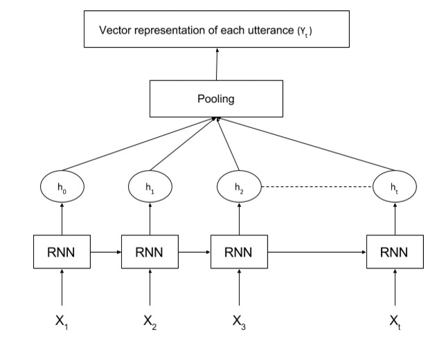

# Chatbot_One_piece_Going_Merry:

About Going Merry
Going merry is a ship from a manga called “One Piece” , which revolves around the story of a bunch of pirates. Going merry is without a doubt, an amazing ship.

Going Merry is a chatbot that I created for a pirate recruitment process. It helps in recruitment of pirates all around the world. this answer user’s simple questions regarding the recruitment process, pre-requisites, etc.This same model can also be used for creating chatbots for any organization

# Introduction:

A chatbot is a software application used to conduct an on-line chat conversation via text . In this blog post, I will show how to create a Simple Chatbot with tensorflow 2 for your organization.

# Dataset Preparation:

once, the dataset is built . half the work is already done. the way we structure the dataset is the main thing in chatbot. I have used a json file to create a the dataset.
json files are just like dictionaries in python. you can store in json files just like you do in dictionaries in python

The data is stored in a json file, which can be imported and used as a pandas dataframe. This data was manually created by me. hence, it’s not that big.
we all know that deep learning requires large chunks of data. but, That is not the case here. I have utilized a neural network architecture powerful enough to handle this small amount of data
